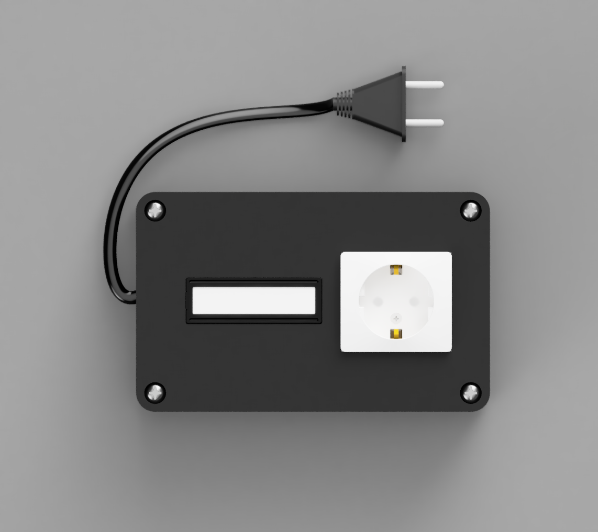
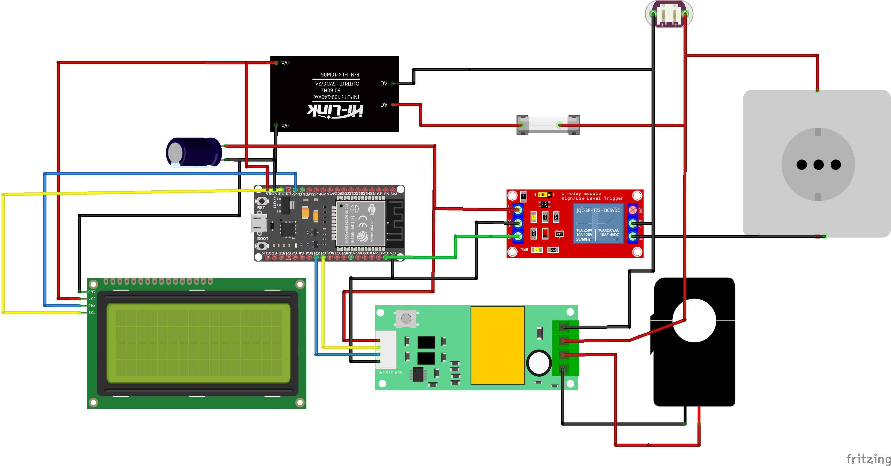
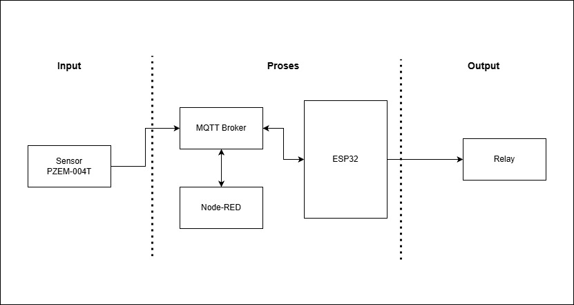

# ⚡ Smart Power Socket
Smart Power Socket is an intelligent IoT energy management system designed to monitor electricity usage in real-time and enforce consumption limits through an automated energy quota-based cutoff mechanism.

    
## 🌟 Key Features
 - Real-Time Monitoring: Tracks Voltage (V), Current (A), Active Power (W), Frequency (Hz), and Power Factor (PF).
- Quota Management: Automatically disconnects the power supply via a relay once the pre-allocated energy quota reaches zero.
- Dual Dashboards: Separate interfaces for Users (monitoring & local control) and Admins (quota top-up & management).
- Secure Global Access: Utilizes Cloudflare Tunneling to provide secure remote access over the public internet without port forwarding.
- Local Status Indicator: Integrated LCD I2C display for immediate visual feedback on WiFi connectivity and relay status.

## 🛠️ Tech Stack

<b>Hardware Components:</b>
- ESP32: Main microcontroller for data processing and WiFi connectivity.
- PZEM-004T: High-precision AC power parameter sensor.
- Current Transformer (CT): Non-contact current measurement.
- Relay Module: Electronic switch for load control.
- LCD 16x2 I2C: Local display for system status.
- Hi-Link HLK-10M05: AC-to-DC (5V) step-down module for internal power supply.

<strong>Software & Infrastructure:</strong>
- Backend Logic: Node-RED.
- Database: InfluxDB.
- Communication: MQTT protocol over WSS.
- Tunneling: Cloudflare Tunnel (cloudflared).
- Frontend: Web-based.
